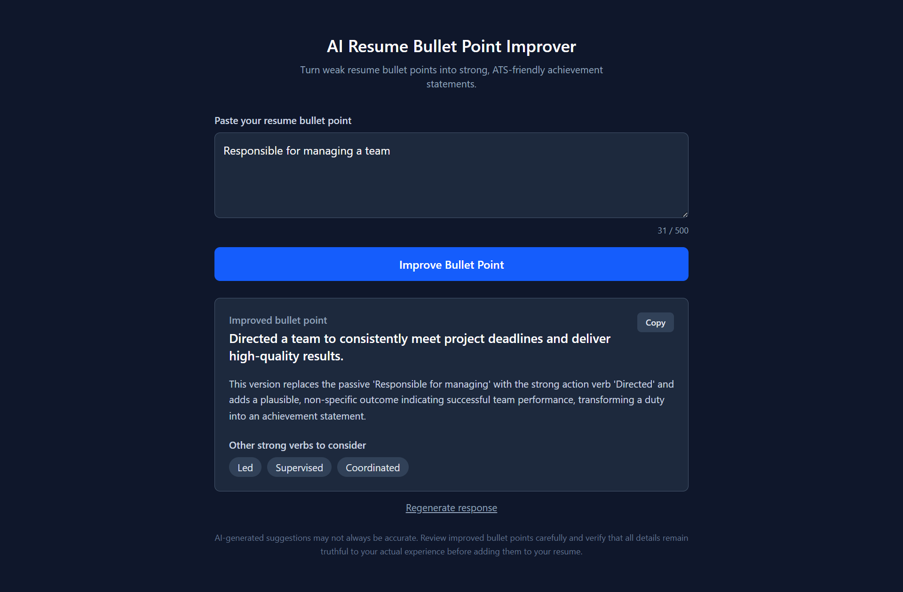

# AI Resume Bullet Point Improver

AI-powered web app that transforms weak resume bullet points into strong, professional, ATS-friendly achievement statements — built as a full-stack portfolio project demonstrating prompt engineering, Responsible AI design, and clean software architecture.

**🔗 Live Demo:** [ai-resume-bullet-improver-gvqn.vercel.app](https://ai-resume-bullet-improver-gvqn.vercel.app)



## Features

- **Improve bullet points** — rewrites weak, passive resume lines into strong, achievement-oriented statements
- **Explanation** — tells you *why* the improved version is stronger, not just what changed
- **Suggested action verbs** — offers alternative strong verbs to use in your own writing
- **Copy to clipboard** — one-click copy of the improved text
- **Regenerate** — get a fresh AI response for the same input
- **Responsible AI disclaimer** — the AI is explicitly instructed never to invent metrics, team sizes, or outcomes not present in the original text, and the UI reminds users to verify accuracy before using suggestions

## Tech Stack

**Frontend:** React, TypeScript, Vite, Tailwind CSS, Axios
**Backend:** Python, FastAPI, Pydantic
**AI:** Google Gemini API (`gemini-2.5-flash`)
**Deployment:** Vercel (frontend + backend, single multi-service deployment)

## Architecture

The project follows Clean Architecture principles with clear separation of concerns:

backend/
├── app/
│   ├── core/        # Centralized configuration (Pydantic Settings)
│   ├── schemas/      # Request/response contracts with custom validation
│   ├── services/     # AI provider integration + prompt engineering
│   └── api/          # Thin route handlers — no business logic
frontend/
├── src/
│   ├── types/         # TypeScript interfaces mirroring backend schemas
│   ├── api/            # Isolated HTTP client layer
│   └── components/     # Single-responsibility, reusable UI components

Routes never call the AI provider directly — they delegate to the `services/` layer, so swapping AI providers only requires changing one file. This design paid off directly during development (see below).

## Engineering Decision: Azure AI Foundry → Google Gemini

This project was originally built to use **Azure AI Foundry / Azure OpenAI**, following Microsoft's "Getting Started with Generative AI in Azure" course. During development, Azure's Free Trial subscription tier was found to provide **zero available quota** for Azure OpenAI model deployments in any region, with no self-service path to request an increase on that subscription type.

Rather than requiring a paid upgrade to demonstrate the project, the AI integration was migrated to **Google Gemini's API**, which is free and required no billing setup. Because the AI-calling logic was isolated in a single `services/` module from the start, this migration required changing only that one file — the API contracts, frontend, and overall architecture were unaffected.

This project is architected so that Azure OpenAI (or any other provider) could be swapped back in by implementing the same service interface.

## Known Limitations

- **Gemini free-tier daily limit:** the live demo uses Gemini's free API tier, which allows a limited number of requests per day. If you see a "daily AI request limit reached" message, this is expected — please try again later or run the project locally with your own API key.
- **Serverless cold starts:** as a Vercel serverless deployment, the first request after a period of inactivity may take a few seconds longer than subsequent ones.

## Local Setup

### Prerequisites
- Node.js (LTS)
- Python 3.11+
- A free [Google Gemini API key](https://aistudio.google.com/app/apikey)

### Backend

```bash
cd backend
python -m venv venv
venv\Scripts\Activate.ps1   # Windows
# source venv/bin/activate  # macOS/Linux
pip install -r requirements.txt
cp .env.example .env        # then add your GEMINI_API_KEY
uvicorn app.main:app --reload
```

### Frontend

```bash
cd frontend
npm install
cp .env.example .env
npm run dev
```

The app will be available at `http://localhost:5173`, calling the backend at `http://localhost:8000`.

## License

MIT